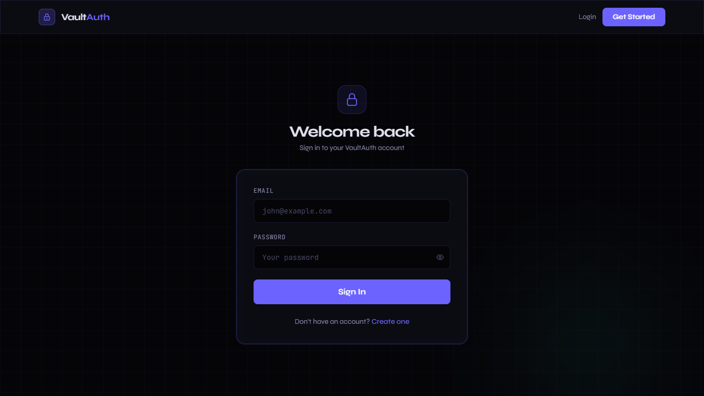
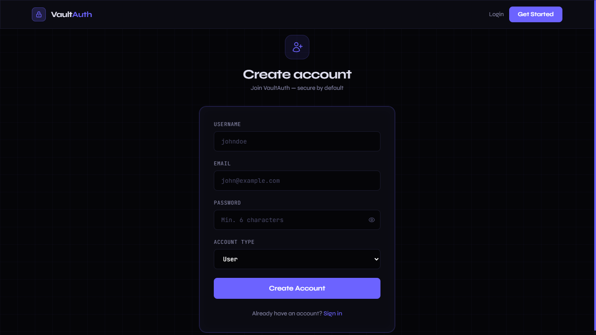
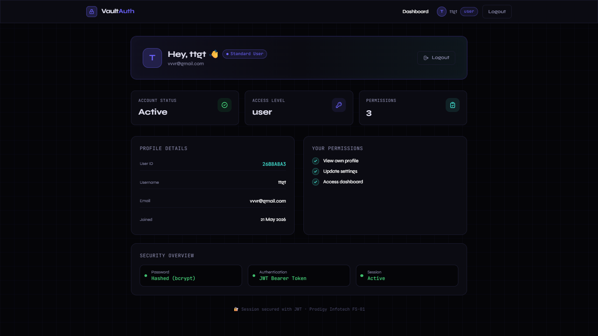

# 🔐 VaultAuth — Secure User Authentication System

> **Prodigy Infotech Full Stack Internship — Task 01**

A production-ready full-stack authentication system built with React, Node.js, Express, MongoDB, and JWT.

---

## 📸 Screenshots

### Login Page


### Register Page


### Dashboard


---

## ✨ Features

- ✅ User Registration with form validation
- ✅ Secure Login with JWT token
- ✅ Password hashing with bcryptjs (salt rounds: 12)
- ✅ JWT-based session management
- ✅ Role-based access control (user / moderator / admin)
- ✅ Protected routes on frontend
- ✅ Auth middleware on backend
- ✅ Duplicate email prevention
- ✅ Toast notifications
- ✅ Loading states & error handling
- ✅ Responsive dark UI
- ✅ MVC folder structure

---

## 🛠 Tech Stack

| Layer       | Tech                          |
|-------------|-------------------------------|
| Frontend    | React 18 + Vite               |
| Styling     | Tailwind CSS                  |
| Routing     | React Router DOM v6           |
| HTTP Client | Axios                         |
| Backend     | Node.js + Express.js          |
| Database    | MongoDB Atlas + Mongoose      |
| Auth        | JWT + bcryptjs                |
| Validation  | express-validator             |
| Dev Tools   | nodemon, concurrently         |

---

## 📁 Project Structure

```
PRODIGY_FS_01/
├── client/                        # React + Vite Frontend
│   ├── src/
│   │   ├── components/
│   │   │   ├── Navbar.jsx
│   │   │   └── ProtectedRoute.jsx
│   │   ├── context/
│   │   │   └── AuthContext.jsx
│   │   ├── pages/
│   │   │   ├── Home.jsx
│   │   │   ├── Login.jsx
│   │   │   ├── Register.jsx
│   │   │   └── Dashboard.jsx
│   │   ├── utils/
│   │   │   └── api.js
│   │   ├── App.jsx
│   │   ├── main.jsx
│   │   └── index.css
│   ├── index.html
│   ├── tailwind.config.js
│   ├── vite.config.js
│   └── package.json
│
├── server/                        # Node.js + Express Backend
│   ├── config/
│   │   └── db.js
│   ├── controllers/
│   │   └── authController.js
│   ├── middleware/
│   │   └── auth.js
│   ├── models/
│   │   └── User.js
│   ├── routes/
│   │   └── authRoutes.js
│   ├── index.js
│   ├── .env.example
│   └── package.json
│
├── .gitignore
├── package.json
└── README.md
```

---

## 🚀 Installation & Setup

### Prerequisites
- Node.js v18+
- MongoDB Atlas account (free tier works)
- Git

### 1. Clone the Repository
```bash
git clone https://github.com/YOUR_USERNAME/PRODIGY_FS_01.git
cd PRODIGY_FS_01
```

### 2. Configure Environment Variables
```bash
cd server
cp .env.example .env
```
Edit `server/.env`:
```env
PORT=5000
MONGO_URI=mongodb+srv://<user>:<pass>@cluster0.xxxxx.mongodb.net/prodigy_auth
JWT_SECRET=your_super_secret_key_here
JWT_EXPIRE=7d
CLIENT_URL=http://localhost:5173
```

### 3. Install All Dependencies
```bash
# From root
npm install
cd client && npm install
cd ../server && npm install
```

### 4. Run the Project

**Option A — Run both together from root:**
```bash
cd ..   # back to root
npm run dev
```

**Option B — Run separately:**
```bash
# Terminal 1 (Backend)
cd server
npm run dev

# Terminal 2 (Frontend)
cd client
npm run dev
```

### 5. Open in Browser
- Frontend: http://localhost:5173
- Backend API: http://localhost:5000/api/health

---

## 🌐 API Routes

| Method | Route                  | Access         | Description          |
|--------|------------------------|----------------|----------------------|
| POST   | /api/auth/register     | Public         | Register new user    |
| POST   | /api/auth/login        | Public         | Login & get token    |
| GET    | /api/auth/profile      | Private (JWT)  | Get logged-in user   |
| GET    | /api/auth/users        | Admin only     | Get all users        |
| GET    | /api/health            | Public         | Server health check  |

---

## 🍃 MongoDB Atlas Setup

1. Go to https://cloud.mongodb.com
2. Create a free cluster (M0)
3. Click **Connect** → **Drivers** → copy the connection string
4. Replace `<username>` and `<password>` in your `.env` MONGO_URI
5. In **Network Access**, add `0.0.0.0/0` (allow all IPs) for development

---

## ☁️ Deployment

### Frontend → Vercel
```bash
cd client
npm run build

# Then go to vercel.com → New Project → import repo
# Set Root Directory to: client
# Build Command: npm run build
# Output Directory: dist
```

### Backend → Render
1. Go to https://render.com → New Web Service
2. Connect GitHub repo
3. **Root Directory**: `server`
4. **Build Command**: `npm install`
5. **Start Command**: `node index.js`
6. Add environment variables from `.env`

---

## 📤 GitHub Push

```bash
git init
git add .
git commit -m "feat: Prodigy FS Task 01 — Secure User Authentication"
git branch -M main
git remote add origin https://github.com/YOUR_USERNAME/PRODIGY_FS_01.git
git push -u origin main
```

---

## 👤 Author

**Megha Raykar**  
Prodigy Infotech Full Stack Internship  
GitHub: [@Megharaykar27](https://github.com/Megharaykar27)

---

## 📄 License

MIT License — feel free to use for learning.
